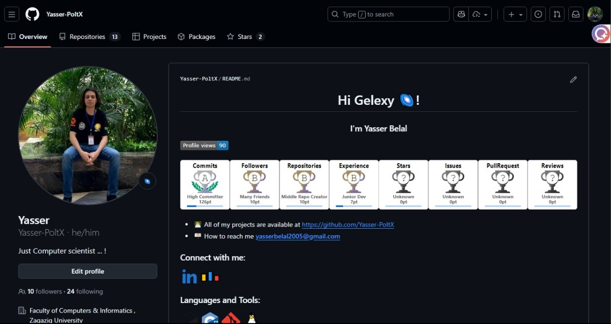
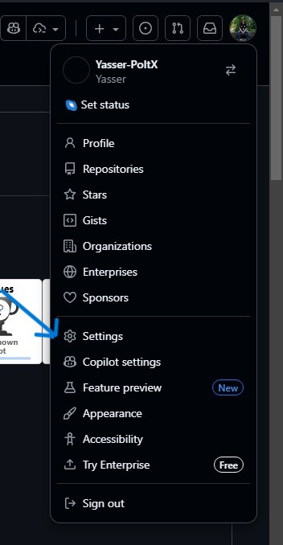
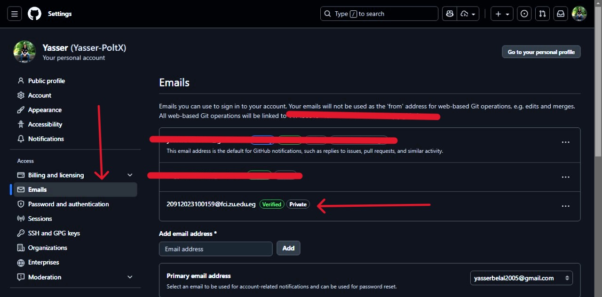
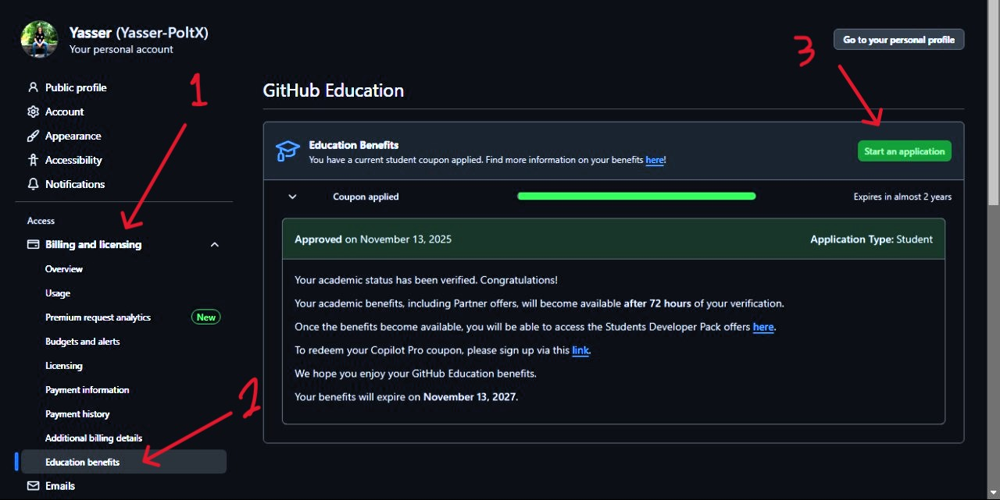
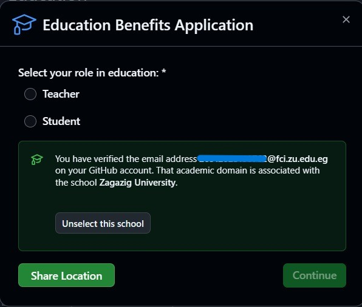
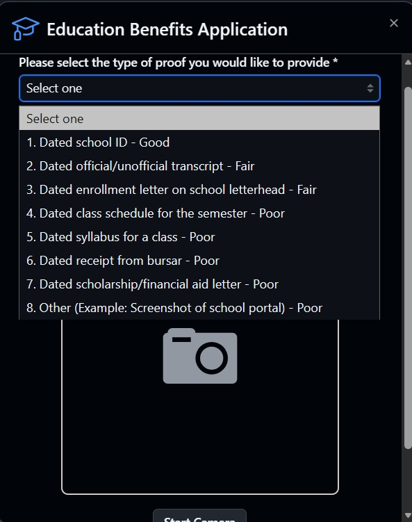
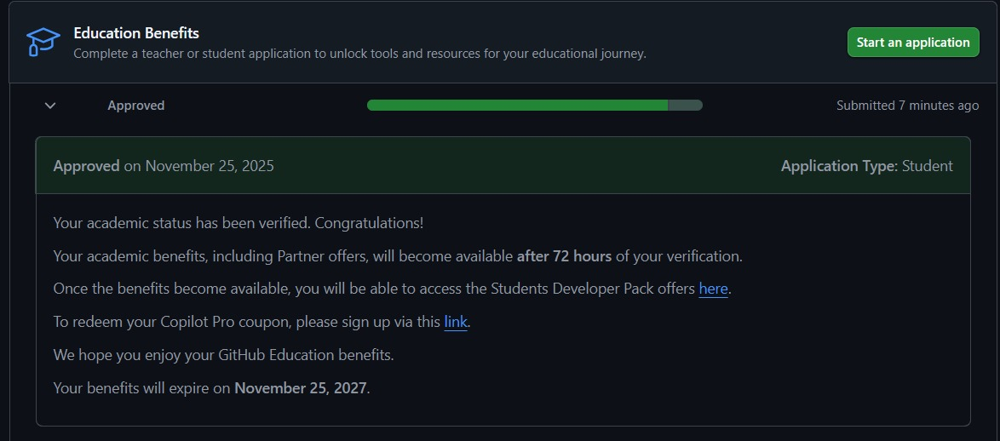

# GitHub Student Developer Pack --- Step-by-Step Guide

## 🎓 What is GitHub Student Developer Pack?

  GitHub Student Pack gives students free access to tools worth over $200,000, including:
-   Microsoft Azure 100$
-   Free domain
-   Cloud credits
-   JetBrains IDEs
-   Canva Pro
-   DigitalOcean credit
-   GitHub Copilot trial
…and much more!

## ✅ Requirements

-   University email 
-   Student ID with a valid date, name, and university

## 🚀 How to Apply

### Step one: Make an account on GitHub 
  https://github.com/signup
  
  

### Step two: Go to settings

  
  
### Step Three: Add the university email to your emails 

  

### Step Four: Go to Billing and licensing, then Education benefits, then Start an application 

  

### Step Five: Here, GitHub automatically chooses the university email -> choose Student

  

### Step Six: Upload your university ID   

  

### Step Seven: You should revive approval; if not, repeat Step 6, and then wait 3 days for it activate
  

------------------------------------------------------------------------

# ⭐ If this repo helped you, give it a star and follow

by Yasser-PoltX🌌
